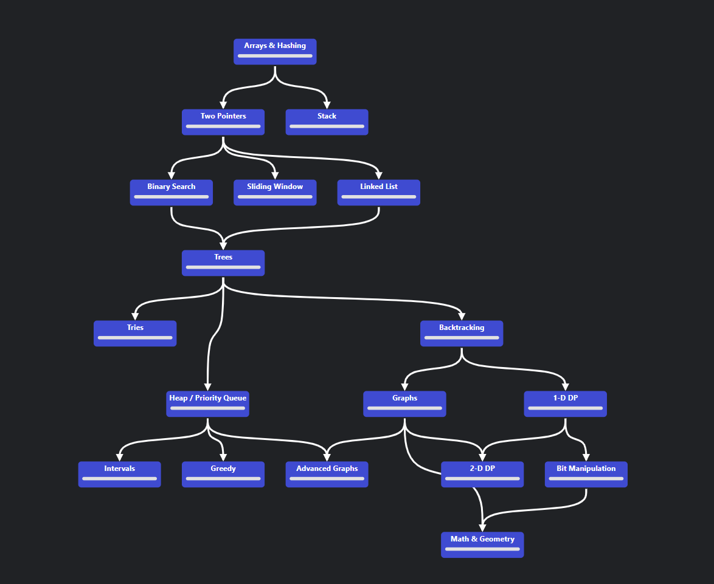

# neetcode-all

This repository contains all the solutions to the problems on [neetcode.io](https://neetcode.io/) and some of the problems on [Leetcode](https://leetcode.com/). The solutions are organized by topic, and each solution is written in Python.

## Tree of Contents

## Topics

- [Level 0: From Leetcode](python/l0_from_leetcode/README.md)
- [Level 1: Arrays and Hashing](python/l1_arrays_and_hashing/README.md)
- [Level 2: Two Pointers](python/l2_two_pointers/README.md)
- [Level 2: Stack](python/l2_stack/README.md)
- [Level 3: Linked List](python/l3_linked_list/README.md)
- [Level 3: Binary Search](python/l3_binary_search/README.md)
- [Level 3: Sliding Window](python/l3_sliding_window/README.md)
- [Level 4: Trees](python/l4_trees/README.md)
- [Level 5: Backtracking](python/l5_backtracking/README.md)
- [Level 7: Bit Manipulation](python/l7_bit_manipulation/README.md)

<!-- STATS_START -->
## Progress

- Total Problems Solved: 143
- Easy: 124
- Medium: 18
- Hard: 1

<!-- STATS_END -->
